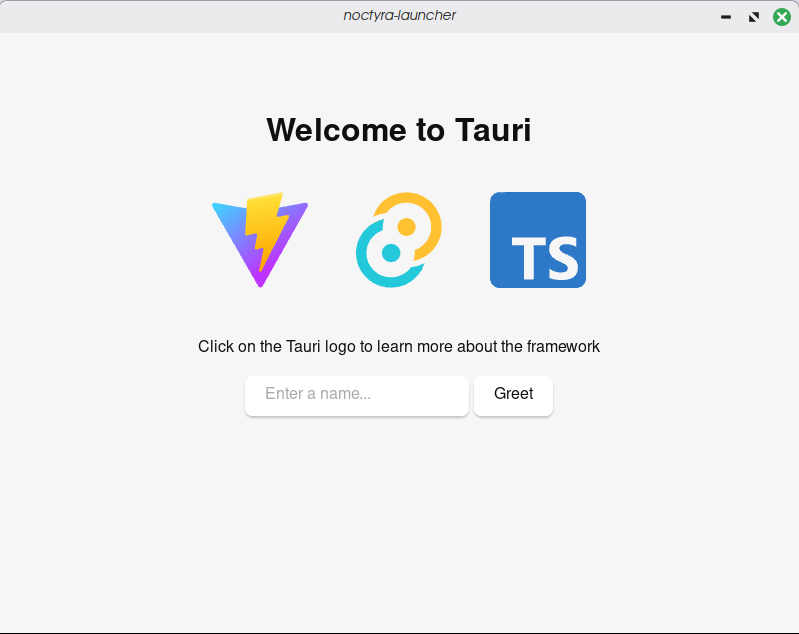

# Noctyra Launcher

A lightweight open source launcher built with Rust, Tauri, and TypeScript.

Created by yZarickZ.

## Goals

- Linux support
- Windows support
- Lightweight
- Customizable
- Open source

## Technologies

- Rust
- Tauri
- TypeScript

## Status

Early development.

## First Prototype

Initial Tauri window after project setup.

## Documentation

- `docs/architecture.md`
- `docs/roadmap.md`
- `docs/decisions.md`
- `docs/notes.md`